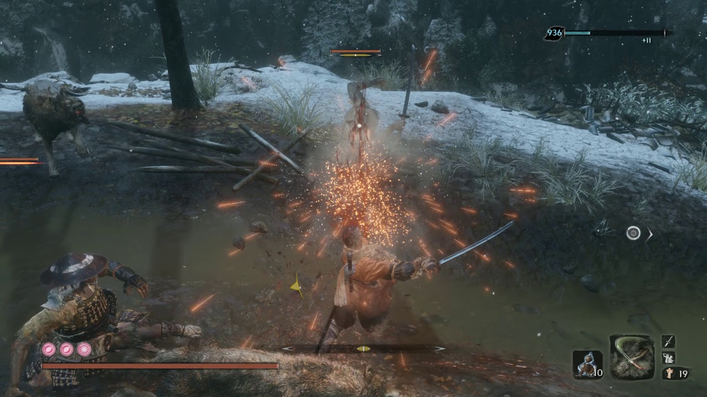
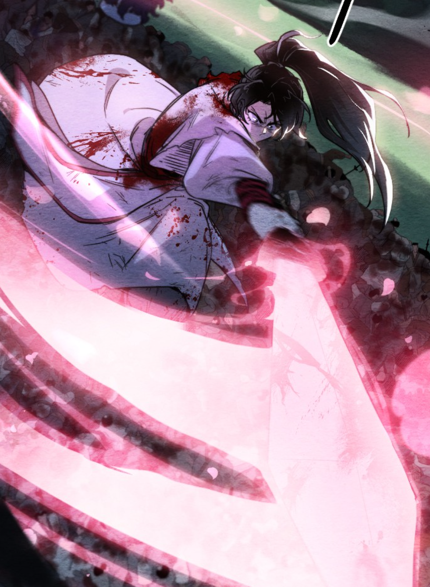
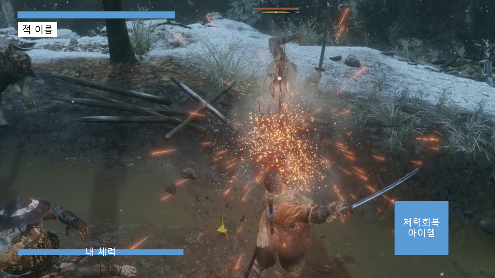
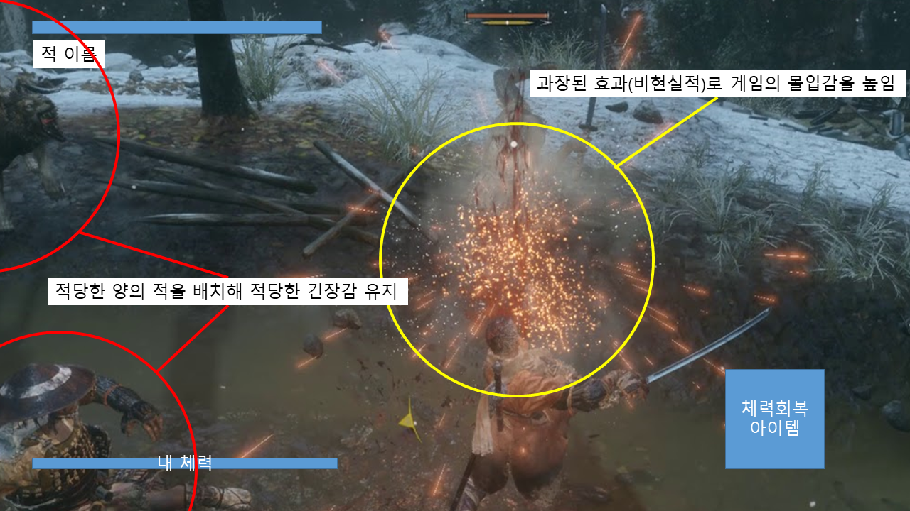
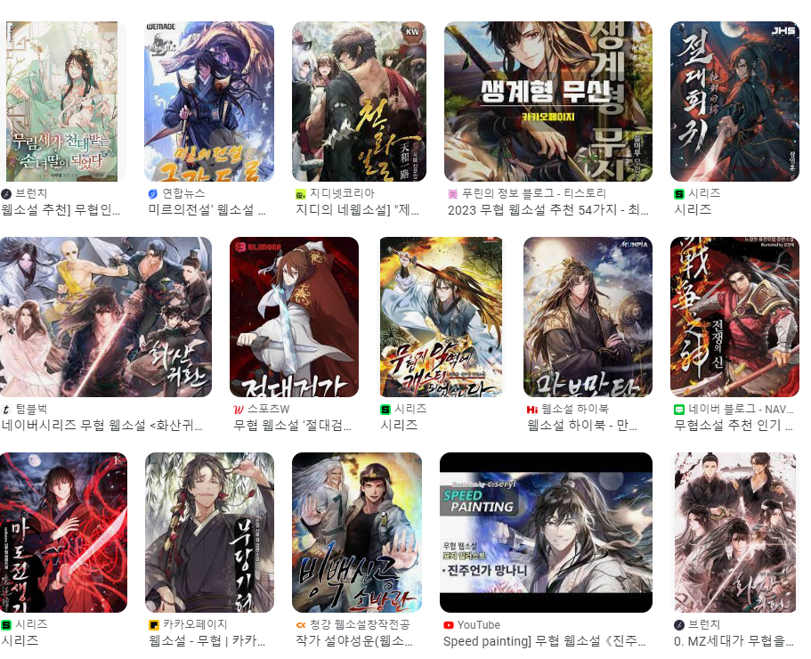
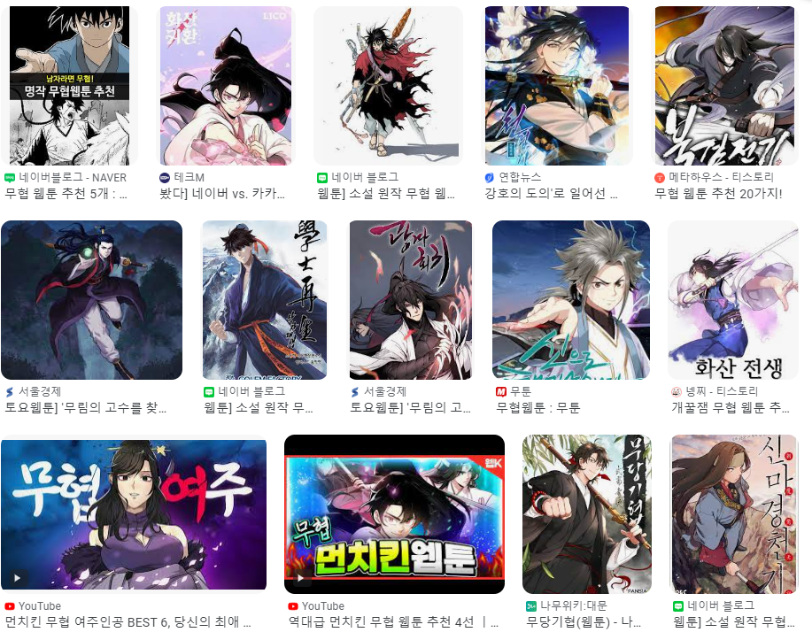
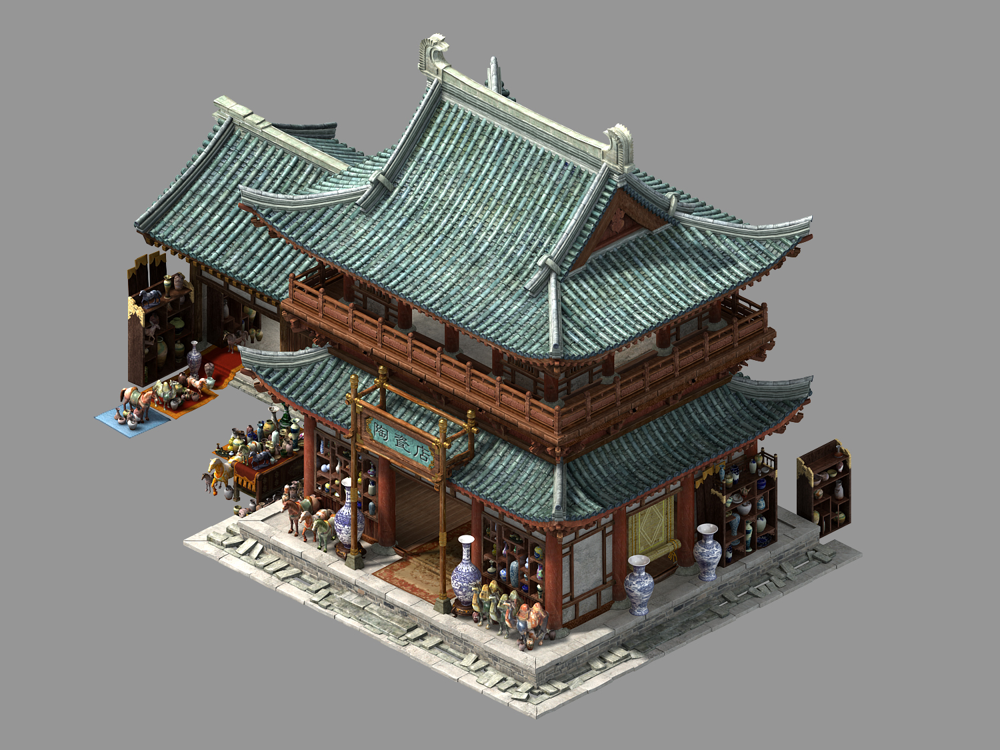
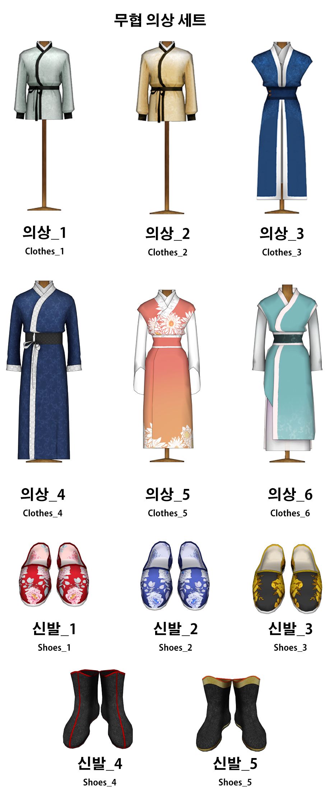

# 매화검수 : 최재영

## 목차

1. [컨셉](#컨셉)
   - [메인 컨셉](#메인-컨셉)
   - [서브 컨셉 1](#서브-컨셉-1)
   - [서브 컨셉 2](#서브-컨셉-2)
   - [서브 컨셉 3](#서브-컨셉-3)
   - [서브 컨셉 4](#서브-컨셉-4)

2. [관련 이미지 & 동영상](#관련-이미지-&-동영상)

3. [대표 이미지](#대표-이미지)

4. [컨셉 & 대표이미지 기반 작품묘사](#컨셉-&-대표이미지-기반-작품묘사)
   - [대표이미지 기반](#대표이미지-기반)
   - [컨셉 기반](#컨셉-기반)

5. [매화검수 구성 요소](#매화검수-구성-요소)
   - [1. 메커니즘](#1-메커니즘)
   - [2. 이야기](#2-이야기)
   - [3. 미적요소](#3-미적요소)
   - [4. 기술](#4-기술)
0. [문서](#문서)
   - [게임 시스템 디자인](#게임-시스템-디자인)

## 컨셉

### 메인 컨셉:

- 타격감 :
게임을 하면 플레이어는 자신의 입력에 따른 게임의 피드백(반응)을 기대한다. 
자신이 특정 입력을 했을 때, 게임에서 여러가지 방법으로 출력을 제공하는데 이 출력이 현실적임을 기대하기도 하고, 상황에 따라서는 과장되거나 말이 안되는 방법일때 더 흥미롭게 받아들일 수 있다. 
이 타격감을 극대화하여 플레이어가 게임에 몰입하고, 높은 만족도를 가질 수 있도록 함. 
유저의 입력에 따른 정확한 애니메이션 출력, 실제로 동작이 일어나는 시간에 맞는 사운드와 이펙트등 현실적인 기반에 과장된 효과를 추가하여 유저로 하여금 타격감을 느낄 수 있도록 함

### 서브 컨셉 1:

- 긴장감 : 콘텐츠적으로 공백을 줄이지만 너무 빽빽하지 않도록해 적당한 긴장감을 유지시키고, 너무 많은 피로도를 느끼지 않도록 설계(레벨디자인)

### 서브 컨셉 2:

- 성취감 : 적들의 공격을 쉽게 클리어할 수 없도록 만들어 유저가 클리어하였을 때, 성취감을 느끼게함(QA)

### 서브 컨셉 3:

- 현실성 : 입력 및 상황에 맞는 정확한 애니메이션, 물리적으로 타격을 했을 때 타격, 상황에 맞는 소리 등 현실세계의 법칙등 현실성을 추가하여, 몰입할 수 있게 함(애니메이션, 물리효과, 소리 등)

### 서브 컨셉 4:

- 비현실성 : 현실에 없는 과장된 효과음, 파티클, 배경음악처럼 몰입을 도와주는 효과와 ui등 없으면 불편한 게임 시스템을 추가한다. (효과음, 이펙트, 배경음악, ui등)

## 관련 이미지 & 동영상

- 이미지  
  
  
  
- 동영상
  

## 대표 이미지

## 컨셉 & 대표이미지 기반 작품묘사

> ### 대표이미지 기반 :

> ### 컨셉 기반:

## 매화검수 구성 요소

-  매화검을 쓰는 검객이 적을 베는 3인칭 액션RPG

### 1. 메커니즘

[도전 과제]

1. 공격해오는 다양한 적들을 물리쳐라
2. 괴인들로부터 세상을 구해라

[재미 요소]

1. 다양한 효과
2. 타격감

### 2. 이야기

[만들게 된 배경]  
- 요즘 무협을 배경으로 한 웹툰, 웹소설등이 나오며 무협 컨텐츠에 대한 수요
- 특히 화산을 배경으로 한 컨텐츠에서 게임으로 만들면 더 재미있을 것 같다는 생각

[참신함]
- 기존 무협게임은 주로 40대가 넘는 사람들을 위한 장르와의 결합이었다면, 만들 게임은 더 젊은 사람들에게 어필할 수 있는 장르인 액션rpg와 결합함

[카메라 관점]  
- 3D 3인칭 시점

[스토리]
- 마교에서 돌림병을 퍼뜨려 사람들에게 폭력성을 증진시키고 이성을 잃게 하여 무림을 혼란에 빠지게 하고 마교에서 무림을 다스리려고 한다.
 
화산파를 포함한 높은산에 있는 세력들만 이 돌림병에 면역이었다. 사형제들과 화산의 대부분의 제자들은 무림의 평화를 가져오기 위해서 떠났다.
 
주인공은 폐관수련중이었고, 폐관수련을 종료한 주인공은 앞에 놓여진 봉서를 보게된다. 봉서에는 먼저 세상을 구하기 위해 떠날테니 너도 채비해서 얼른 오라는 글이 쓰여있었다.
 
화산파의 천재라고 불린 주인공은 이제 사람들을 되돌리고, 마교를 벌하기 위해 길을 나선다.
 
적: 돌림병에 걸린 일반인, 돌림병에 걸린 무림인, 마교인
 

### 3. 미적요소

[디자인]
- 무협 배경이므로 그 시대에 맞는 건물, 오브젝트, 복장, 적 에셋 사용
  
  
- UI 또한 시대 느낌이 나게 설정

[컬러]  
- 배경의 주 색은 실제로 세계가 위협에 빠진듯한 포스트 아포칼립스 또는 멸망 직전의 분위기의 조명색

- 플레이어의 검술은 화려한 이펙트가 출력되도록 함

[음향]  
약간의 긴장감을 주는 음악을 크지 않은 소리로 틀고, 효과음은 크게 출력되도록 함.

### 4. 기술

Unity 3D로 개발할 예정이며, 개발이 완료된 이후에는 웹 빌드하여 itch.io에 게시예정

#문서

## 게임 시스템 디자인

[게임 시스템 디자인](docs/게임시스템디자인_최재영.pdf)
