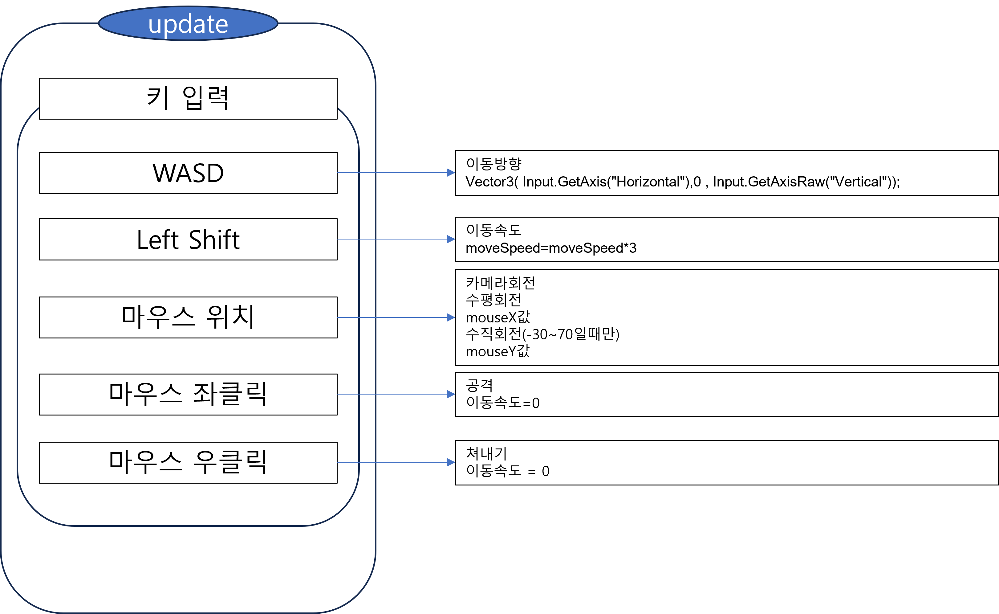

# 매화검수 : 최재영

## 목차

1. [컨셉](#컨셉)
   - [메인 컨셉](#메인-컨셉)
   - [서브 컨셉 1](#서브-컨셉-1)
   - [서브 컨셉 2](#서브-컨셉-2)
   - [서브 컨셉 3](#서브-컨셉-3)
   - [서브 컨셉 4](#서브-컨셉-4)

2. [관련 이미지 & 동영상](#관련-이미지-&-동영상)

3. [대표 이미지](#대표-이미지)

4. [컨셉 & 대표이미지 기반 작품묘사](#컨셉-&-대표이미지-기반-작품묘사)
   - [대표이미지 기반](#대표이미지-기반)
   - [컨셉 기반](#컨셉-기반)

5. [매화검수 구성 요소](#매화검수-구성-요소)
   - [1. 메커니즘](#1-메커니즘)
   - [2. 이야기](#2-이야기)
   - [3. 미적요소](#3-미적요소)
   - [4. 기술](#4-기술)
6. [게임 시스템 디자인](#게임-시스템-디자인)

7. [개발 요구사항 & 흐름도](#요구사항-흐름도)
   - [요구사항](#요구사항)
   - [시간별 흐름도 flowchart](#시간별흐름도)
   - [키보드 이벤트에 대한 흐름도](#키보드흐름도)
   - [용어정리](#용어정리)
8. [스토리보드](#스토리보드)
9. [프로토타입 개발 요구사항 (6주개발)](#6주요구사항)
10. [프로토타입 개발작업 일정 (6주개발)](#6주개발사항)
0. [문서](#문서)
   - [게임 시스템 디자인](#게임-시스템-디자인-문서)

## 컨셉

### 메인 컨셉:

- 타격감 :
게임을 하면 플레이어는 자신의 입력에 따른 게임의 피드백(반응)을 기대한다. 
자신이 특정 입력을 했을 때, 게임에서 여러가지 방법으로 출력을 제공하는데 이 출력이 현실적임을 기대하기도 하고, 상황에 따라서는 과장되거나 말이 안되는 방법일때 더 흥미롭게 받아들일 수 있다. 
이 타격감을 극대화하여 플레이어가 게임에 몰입하고, 높은 만족도를 가질 수 있도록 함. 
유저의 입력에 따른 정확한 애니메이션 출력, 실제로 동작이 일어나는 시간에 맞는 사운드와 이펙트등 현실적인 기반에 과장된 효과를 추가하여 유저로 하여금 타격감을 느낄 수 있도록 함

### 서브 컨셉 1:

- 긴장감 : 콘텐츠적으로 공백을 줄이지만 너무 빽빽하지 않도록해 적당한 긴장감을 유지시키고, 너무 많은 피로도를 느끼지 않도록 설계(레벨디자인)

### 서브 컨셉 2:

- 성취감 : 적들의 공격을 쉽게 클리어할 수 없도록 만들어 유저가 클리어하였을 때, 성취감을 느끼게함(QA)

### 서브 컨셉 3:

- 현실성 : 입력 및 상황에 맞는 정확한 애니메이션, 물리적으로 타격을 했을 때 타격, 상황에 맞는 소리 등 현실세계의 법칙등 현실성을 추가하여, 몰입할 수 있게 함(애니메이션, 물리효과, 소리 등)

### 서브 컨셉 4:

- 비현실성 : 현실에 없는 과장된 효과음, 파티클, 배경음악처럼 몰입을 도와주는 효과와 ui등 없으면 불편한 게임 시스템을 추가한다. (효과음, 이펙트, 배경음악, ui등)

## 관련 이미지 & 동영상

- 이미지  
  
  
  
- 동영상
  

## 대표 이미지

## 컨셉 & 대표이미지 기반 작품묘사
(UI) 몰입감, 현실성을 최대로 주지만, 게임하는데 불편하지 않도록, ui종류와 크기를 최소화하여 배치
(시점) 3인칭 시점으로 캐릭터의 어깨 뒤에 카메라가 배치됨
(전투) 적당한 수의 적을 배치해, 긴장감을 유지함. 전투의 난이도를 쉽지않게 만들어 성취감을 느끼게함.
현실적인 애니메이션과 충돌처리를 통해 현실성을 느낄수 있다. 과장된 효과로 재미를 극대화시킴

## 매화검수 구성 요소

-  매화검을 쓰는 검객이 적을 베는 3인칭 액션RPG

### 1. 메커니즘

[도전 과제]

1. 공격해오는 다양한 적들을 물리쳐라
2. 괴인들로부터 세상을 구해라

[재미 요소]

1. 다양한 효과
2. 타격감

### 2. 이야기

[만들게 된 배경]  
- 요즘 무협을 배경으로 한 웹툰, 웹소설등이 나오며 무협 컨텐츠에 대한 수요
- 특히 화산을 배경으로 한 컨텐츠에서 게임으로 만들면 더 재미있을 것 같다는 생각

[참신함]
- 기존 무협게임은 주로 40대가 넘는 사람들을 위한 장르와의 결합이었다면, 만들 게임은 더 젊은 사람들에게 어필할 수 있는 장르인 액션rpg와 결합함

[카메라 관점]  
- 3D 3인칭 시점

[스토리]
- 마교에서 돌림병을 퍼뜨려 사람들에게 폭력성을 증진시키고 이성을 잃게 하여 무림을 혼란에 빠지게 하고 마교에서 무림을 다스리려고 한다.
 
화산파를 포함한 높은산에 있는 세력들만 이 돌림병에 면역이었다. 사형제들과 화산의 대부분의 제자들은 무림의 평화를 가져오기 위해서 떠났다.
 
주인공은 폐관수련중이었고, 폐관수련을 종료한 주인공은 앞에 놓여진 봉서를 보게된다. 봉서에는 먼저 세상을 구하기 위해 떠날테니 너도 채비해서 얼른 오라는 글이 쓰여있었다.
 
화산파의 천재라고 불린 주인공은 이제 사람들을 되돌리고, 마교를 벌하기 위해 길을 나선다.
 
적: 돌림병에 걸린 일반인, 돌림병에 걸린 무림인, 마교인
 

### 3. 미적요소

[디자인]
- 무협 배경이므로 그 시대에 맞는 건물, 오브젝트, 복장, 적 에셋 사용
  
  
- UI 또한 시대 느낌이 나게 설정

[컬러]  
- 배경의 주 색은 실제로 세계가 위협에 빠진듯한 포스트 아포칼립스 또는 멸망 직전의 분위기의 조명색

- 플레이어의 검술은 화려한 이펙트가 출력되도록 함

[음향]  
약간의 긴장감을 주는 음악을 크지 않은 소리로 틀고, 효과음은 크게 출력되도록 함.

### 4. 기술

Unity 3D로 개발할 예정이며, 개발이 완료된 이후에는 웹 빌드하여 itch.io에 게시예정

## 게임 시스템 디자인
### 1. 게임  오브젝트  분해  (구성  요소  분석)

---

|**연번**|**종류**|**OBJ 이름**|**Obj 영문명**|**사용처**|**오브젝트  이미지**|
| - | - | - | - | - | - |
|1|플레이어|주인공|player|공통||
|2|적|일반인|e\_Easy|1,2  스테이지||
|3|적|무림인|e\_Normal|2,3  스테이지||
|4|적|마교인|e\_Hard|4  스테이지||
|5|무기|검|sword|공통||
|6|아이템|회복  물약|potion|공통||
|7|ui|내  체력|p\_HpUI|공통|![ref1]|
|8|ui|적  체력|e\_HpUI|공통|![ref1]|
|9|ui|적  이름|e\_NameUI|공통||
|10|ui|회복 아이템  창|potionUI|공통||
|11|상호작용  오브젝트|포탈|portal|스테이지  이동||
|12|상호작용  오브젝트|편지|letter |스토리  진행||
|13|상호작용  오브젝트|울타리 |fence |파괴  가능한 벽||

---

### 2. 파라미터(속성)  뽑아  보기
1) 오브젝트  이름  :  player

|**속성**|**영문명칭**|**설명**|**비고**|
| - | - | - | - |
|최대체력|maxHp|플레이어의  체력이  가질  수  있는  최대치|-int|
|현재체력|hp|플레이어의  체력|-int|
|공격력|dmg|플레이어가  적에게  입히는  데미지|+int|
|이동속도|moveSpeed|플레이어가  이동하는  속도|-float|
|포션  개수|potionCount|현재  사용가능한  포션  개수|-int|
|포션  개수  ui|potionCountUI|현재  사용가능한  포션  개수를  표시할  UI|-Text|
|상태|state|플레이어의  동작  상태  (기본,  쳐내기,  피격,  사망)|+enum|
|체력ui|hpBar|플레이어의  체력을  표시할  ui|-Image|
|기준위치|spawnPoint|부활시  플레이어를  생성할  위치|Transform|
|검  콜라이더|weaponCollider|무기의  콜라이더|Collider|

2) 오브젝트  이름  :  e\_Easy,  e\_Normal,  e\_Hard

|**속성**|**영문명칭**|**설명**|**비고**|
| - | - | - | - |
|체력|hp|적의  체력|int|
|공격력|dmg|적이  플레이어에게  입히는  데미지|int|
|이동속도|moveSpeed|적이  이동하는  속도|float|
|이름|name|적의  이름|int|
|대상|target|이동할  대상  적이  범위  내에  들어왔을  시  적, 범위를  벗어났을  때는  기본위치|Transform|
|기준위치|spawnPoint|적을  생성할  위치,  적이  없을  때,  돌아갈  위치|Transform|
|체력ui|hpBar|적의  체력을  표시할  ui|Image|
|이름ui|nameUI|적의  이름을  표시할  ui|Text|
|무기  콜라이더|weaponCollider|무기의  콜라이더|Collider|

3) 오브젝트  이름  :  portal

|**속성**|**영문명칭**|**설명**|**비고**|
| - | - | - | - |
|출구포탈|exit|포탈에  충돌했을  때,  이동시켜줄  출구포탈  오브젝트|gameObject|

4) 오브젝트  이름  :  letter

|**속성**|**영문명칭**|**설명**|**비고**|
| - | - | - | - |
|편지내용|letter|편지에  표시될  내용|string|
|편지배경|letterCanvas|편지  ui에  표시될  캔버스|gameObject|

5) 오브젝트  이름  :  potion

|**속성**|**영문명칭**|**설명**|**비고**|
| - | - | - | - |
|포션이미지|potionSprite|포션ui에  표시될  이미지|sprite|
|포션회복량|healAmount|포션을  사용했을  때,  체력을  회복하는  정도(퍼센트  [0,1])|float|
|||||

### 3. 행동  뽑아  보기
1) 오브젝트  이름  :  player

|**행동**|**영문명칭**|**설명**|
| - | - | - |
|이동|Move|wasd로  입력을  받아  이동한다. shift를  누르면  이동속도가  증가한다.|
|공격|Attack|무기의  콜라이더를  켜고  애니메이션을  출력|
|쳐내기|Parry|공격  쳐내기 플레이어가 쳐내기 기술을 사용해 쳐내기 애니메이션을 출력 0.3초  동안  **쳐내기  상태**가  됨**쳐내기  상태**에서  피격시:1. 플레이어의  피격  없음.2. 플레이어는  쳐내기  성공  애니메이션  출력3. 적은  공격  실패  애니메이션  출력4. 쳐내기  성공  이펙트,  사운드  출력쳐내기 기술을 사용했을 때,  쳐내기 애니메이션이 출력되는지 쳐내기 기술을 사용했을  때,  쳐내기 콜라이더가 생성되는지 쳐내기 기술  사용중일 때, 피격시 쳐내기 성공으로 이어지는지 쳐내기 기술  시간이 종료되었을 때, 쳐내기 콜라이더가 사라지는지 쳐내기 기술  시간이 종료되었을 때, 쳐내기 애니메이션이 종료되는지 쳐내기  효과가  종료되고  피격되었을  때는 기존의  피격효과와  동일한지  확인쳐내기 성공했을 때  이펙트,사운드 가  정상출력 되는지 확인 쳐내기 성공했을 때  플레이어의 hp가  감소되지 않는지 확인 쳐내기 성공했을 때  쳐내기 성공  애니메이션이 출력되는지 확인- 사운드는  배경음보다  크게(우선  순위가  높다)- 카운터  스킬  개념- 피격  시간은  Inspector에서  조절  가능- **쳐내기 상태**  0.3초  동안  애니메이션이 존재하고 이동  불가(0.3초  포함  X)- 이미  피격이  된  공격에  대해서는  쳐내기가  안  된다.- 재사용  대기  시간  없다.- 쳐내기는  스킬  1회당  공격  1회를  막는다.- 모든  피격  판정에  대해  발동한다.- 데미지  없이  막는  스킬- 투사체를  막아낼  시  사라진다. 투사체  발사자는  공격  실패  판정을  갖지  않는다.|
|피격|Hit(int  dmg)|적의  공격에  충돌하였을  때  호출 플레이어의  hp를  적의  공격력만큼 감소시킨다.|
|포션사용|UsePotion()|포션의  개수가  1개  이상이면,potion의  healAmount\*maxHp만큼 체력을 더하고 potionCount의  개수를  1만큼  감소시키고. potionCountUI의  text를  업데이트한다.|
|부활|Revive()|spawnPoint위치로  플레이어를  부활시키고, 상태를  기본상태로  전환한다.  부활  애니메이션 을  출력한다.|
|사망|Die()|hp가  0이하가 되면  호출,  일정 시간  이후에 부활을 호출|

2) 오브젝트  이름  :  e\_Easy,  e\_Normal,  e\_Hard

|**행동**|**영문명칭**|**설명**|
| - | - | - |
|대상  찾기|FindEnemy()|길이가  정해진  ray를  플레이어  방향으로  발사 한다.  이  ray에  플레이어가  맞으면  target에 플레이어가  들어간다.  없으면  spawnpoint와 일정거리내의  위치가  저장된다.|
|이동|Move (Transform target)|target위치로  이동한다.|
|공격|Attack|적이  공격사거리  안으로  들어오면,  대상을  바 라보고  공격애니메이션을  실행,  무기의  콜라이 더를  켜준다.  공격이  종료될  때  까지  이동과 회전이  불가능하다.|
|피격|Hit(int  dmg)|플레이어의  공격에  충돌하였을  때  호출 자신의 hp를  플레이어의 공격력만큼 감소시킨다.|
|사망|Die()|hp가  0이하가  되면 호출,  일정 시간  이후에 부활을 호출|
|부활|Revive()|spawnPoint위치로  플레이어를  부활시키고, 상태를  기본상태로  전환한다.  부활  애니메이션 을  출력한다.|

3) 오브젝트  이름  :  portal

|**행동**|**영문명칭**|**설명**|
| - | - | - |
|포탈  이동|OnCollisionEnter|collision이  플레이어면,exit의  position으로  이동시킨다.|

4) 오브젝트  이름  :  potion

|**행동**|**영문명칭**|**설명**|
| - | - | - |
|포션  사용|UsePotion()|키  입력시  player의  hp를  수치만큼  증가시킨 다|

### 4. 상태  뽑아  보기

1)  오브젝트  이름  :  player

|**현상태**|**전이상태**|**전이조건**|
| - | - | - |
|기본|쳐내기|쳐내기  키에  해당하는  입력시|
|쳐내기|기본|쳐내기  시간  종료시|
|기본|사망|hp가  0이하가  되면  전이|
|사망|기본|사망하고  일정  시간  이후  전이|

### 5. 플레이어  캐릭터  속성(파라미터)

|**속성**|**영문명칭**|**설명**|**비고**|
| - | - | - | - |
|최대체력|maxHp|플레이어의  체력이  가질  수  있는  최대치|-int|
|현재체력|hp|플레이어의  체력|-int|
|공격력|dmg|플레이어가  적에게  입히는  데미지|+int|
|이동속도|moveSpeed|플레이어가  이동하는  속도|-float|
|포션  개수|potionCount|현재  사용가능한  포션  개수|-int|
|상태|state|플레이어의  동작  상태  (기본,  쳐내기,  피격,  사망)|+enum|
|기준위치|spawnPoint|부활시  플레이어를  생성할  위치|Transform|

### 6. 게임의  규칙

1) 핵심  규칙

플레이어는  기본적으로  1,2,3,4스테이지  순서로  진행

스테이지  완료  조건은  각  스테이지에  수문장  적을  죽이고  포탈에  들어가면  완료로  판정 승리조건(엔딩)은  모든  스테이지를  완료

스테이지를  시작하면  정해진  위치에  모든  적이  생성됨

적을  죽이고  일정  시간이  지나면  적이  spawnpoint에  다시  생성됨

공격할  때만  공격충돌판정이  있음.

마우스  좌클릭하면  공격을  할  수  있다.

공격이  적에게  충돌  시  플레이어의  데미지만큼  적의  hp를  감소시킨다.

플레이어/적은  hp가  0  이하가  되면  사망한다.

플레이어가  사망할시  일정  시간  이후에  부활(씬  재시작)

마우스  우클릭을  하면  쳐내기  상태가  된다.

쳐내기  상태에서는  우클릭을  입력해도  쳐내기  상태가  시작되거나,  시간이  연장되지  않는다.

2) 보조  규칙

파괴가  가능한  울타리를  일정  횟수  공격할  시  파괴된다.

### 7. 게임에서  사용될  공식

공격  성공  시  데미지  계산 피격된오브젝트의hp  -=  공격한오브젝트의공격력 달리기속도  제한

달리기할  때  이동속도<  3\*기본  이동속도

[ref1]: img/Aspose.Words.5f80b5a7-f03e-4ed9-9853-79b3868489fd.007.png

## 요구사항 흐름도

### 요구사항

#### 1년요구사항 

1. **메뉴 구성:**
   - 1-1. 메인화면
     - 1-1-1. 게임시작 버튼
     - 1-1-2. 게임종료 버튼
   - 1-2. 게임화면 (스테이지 1, 2, 3, 4)
   - 1-3. 엔딩화면

2. **화면 구성 요소:**
   - 2-1. 메인화면
     - 2-1-1. 게임시작 버튼
     - 2-1-2. 게임종료 버튼
   - 2-2. 게임화면
     - 2-2-1. 적 이름 UI
     - 2-2-2. 적 HP UI
     - 2-2-3. 플레이어 HP UI
     - 2-2-4. 포션 개수 UI
     - 2-2-5. 플레이어 모습 (3인칭)
   - 2-3. 엔딩화면

3. **게임 진행:**
   - 3-1. 게임 시작 클릭 시 스테이지 1로 이동
   - 3-2. 각 스테이지에는 수문장 몬스터와 포탈이 존재
   - 3-3. 수문장 몬스터를 물리치면 포탈이 생성
   - 3-4. 포탈에 들어가면 다음 스테이지로 이동
   - 3-5. 마지막 스테이지에서 수문장 몬스터를 물리치면 엔딩화면으로 이동
   - 3-6. 플레이어 사망 시 해당 스테이지를 재시작

4. **플레이어 조작키 할당:**
   - 4-1. 이동: WASD
   - 4-2. 화면 회전: 마우스
   - 4-3. 공격: 좌클릭
   - 4-4. 쳐내기: 우클릭

5. **캐릭터 기능 구현:**
   - 5-1. 이동 WASD로 이동, Shift키 입력시 이동속도 상승
   - 5-2. 공격 좌클릭을 하면 무기 충돌판정이 켜짐
   - 5-3. 쳐내기 우클릭시 쳐내기 상태가됨 맞으면 쳐내기 효과
   - 5-4. 피격 적에게 피격시 hp가 감소되는 기능 구현
   - 5-5. 사망 hp가 0이하가 되면 캐릭터가 사망하고 조종이 불가능함
   - 5-6. 부활 사망이 되고 일정시간 이후에 씬을 재시작
   - 5-7. 카메라 회전 (마우스 위치값에 따라 카메라 회전, 위아래 회전은 30~-10도로 제한)
   - 5-8. 포션 사용 포션을 사용하면 현재체력이 증가함
   - 5-9. 애니메이션 (각 행동에 맞는 애니메이션 출력)

6. **적 기능 구현:**
   - 6-1. 이동 목표를 향해 이동하는 기능 목표가 없으면 주변을 랜덤으로 이동
   - 6-2. 공격 사거리 이내로 들어왔을 때 적의 공격 충돌판정을 켜는 기능
   - 6-3. 플레이어 인식 ray를 발사하여 플레이어가 닿으면 타겟이 플레이어가됨
   - 6-4. 사망 hp가 0이하가 되면 적이 사망함
   - 6-5. 생성 사망하고 일정시간이 경과하면 재생성함
   - 6-6. 피격 플레이어의 공격 콜라이더와 충돌하면 hp가 플레이어의 공격력만큼 감소
   - 6-7. 애니메이션 (각 행동에 맞는 애니메이션 출력)

7. **UI 구현:**
   - 7-1. 적 체력 UI (화면 왼쪽 상단에 적의 체력을 표시하는 UI, 적을 때리면 그 적의 체력이 담김)
   - 7-2. 적 이름 UI (적 체력 UI 상단에 적의 이름이 담김, 적을 때리면 그 적의 이름이 담김)
   - 7-3. 플레이어 HP UI (화면 좌하단에 플레이어의 체력 표시, 플레이어의 체력값에 따라 바뀜)
   - 7-4. 화면 회전/이동 설명서 (화면 회전, 이동에 관한 설명 UI)
   - 7-5. 달리기 설명서 (달리기에 관한 설명 UI)
   - 7-6. 전투 설명서 (전투에 관한 설명 UI)
   - 7-7. 편지창 UI (편지 오브젝트에 다가갔을 때 출력될 UI, 안에는 편지 내용이 담겨야 함)
   - 7-8. 포션 UI (현재 포션 보유 개수를 표시)

8. **오브젝트 구현:**
   - 8-1. 편지 (충돌 시 편지 UI 출력)
   - 8-2. 포탈 (충돌 시 스테이지 클리어)
   - 8-3. 파괴 가능 울타리 (3번 피격 시 파괴)

9. **시스템 구현:**
   - 9-1. 스테이지 클리어 시 저장 구현
   - 9-2. 클리어 기록이 있다면 해당 스테이지까지 선택 가능

10. **효과 추가:**
   - 10-1. 사운드 효과 추가
   - 10-2. 파티클 시스템 추가

### 시간별흐름도
   

   
### 키보드흐름도
   

### 용어정리
   

## 스토리보드

## 6주요구사항

1. **플레이어 기능 구현**
   - 이동 (4, 5-1) WASD로 이동, Shift키 입력시 이동속도 상승
   - 공격 (5-2) 좌클릭을 하면 무기 충돌판정이 켜짐
   - 카메라 회전 (5-7) 마우스 위치값에 따라 카메라 회전, 위아래 회전은 30~-10도로 제한

2. **적 기능 구현**
   - 이동 (6-1) 목표를 향해 이동하는 기능 목표가 없으면 주변을 랜덤으로 이동
   - 공격 (6-2) 사거리 이내로 들어왔을 때 적의 공격 충돌판정을 켜는 기능
   - 피격 (6-6) 플레이어의 공격 콜라이더와 충돌하면 hp가 플레이어의 공격력만큼 감소

3. **플레이어 기능 구현**
   - 피격 (5-4) 적에게 피격시 hp가 감소되는 기능 구현
   - 사망 (5-5) hp가 0이하가 되면 캐릭터가 사망하고 조종이 불가능함
   - 부활 (5-6) 부활 사망이 되고 일정시간 이후에 씬을 재시작

4. **애니메이션 추가**
   - 플레이어 (5-9) 각 행동에 맞는 애니메이션 출력
   - 적 (6-7) 각 행동에 맞는 애니메이션 출력

5. **포션 사용**
   - 포션 사용 (5-8) 포션 사용 포션을 사용하면 현재체력이 증가함
   - UI 추가 (7-8)
   - 적 체력 UI  (7-1) (화면 왼쪽 상단에 적의 체력을 표시하는 UI, 적을 때리면 그 적의 체력이 담김) 
   - 적 이름 UI (7-2) (적 체력 UI 상단에 적의 이름이 담김, 적을 때리면 그 적의 이름이 담김) 
   - 플레이어 HP UI (7-3)  (화면 좌하단에 플레이어의 체력 표시, 플레이어의 체력값에 따라 바뀜) 

6. **사운드, 이펙트, UI 추가**
   - 사운드 효과 추가 (10-1) 공격, 배경, 피격, 기본, 이동 사운드 효과 추가
   - 파티클 시스템 추가 (10-2) 피격,공격, 배경파티클 시스템 추가
   - 기타 UI 추가 (7) 기타 UI 추가

## 6주개발사항

1. **플레이어 기능 구현**
   - ~~이동 (4, 5-1) WASD로 이동, Shift키 입력시 이동속도 상승~~
   - ~~공격 (5-2) 좌클릭을 하면 무기 충돌판정이 켜짐~~ 
   - ~~카메라 회전 (5-7) 마우스 위치값에 따라 카메라 회전 위아래 회전은 30-10도로 제한~~

2. **적 기능 구현**
   - ~~이동 (6-1) 목표를 향해 이동하는 기능 목표가 없으면 주변을 랜덤으로 이동~~
   - ~~공격 (6-2) 사거리 이내로 들어왔을 때 적의 공격 충돌판정을 켜는 기능~~
   - ~~피격 (6-6) 플레이어의 공격 콜라이더와 충돌하면 hp가 플레이어의 공격력만큼 감소~~
   - 

3. **플레이어 기능 구현**
   - ~~피격 (5-4) 적에게 피격시 hp가 감소되는 기능 구현~~
   - ~~사망 (5-5) hp가 0이하가 되면 캐릭터가 사망하고 조종이 불가능함~~
   - ~~부활 (5-6) 부활 사망이 되고 일정시간 이후에 씬을 재시작~~
   - 
   - 

4. **애니메이션 추가**
   - 플레이어 (5-9) 각 행동에 맞는 애니메이션 출력
   - 적 (6-7) 각 행동에 맞는 애니메이션 출력
   - 

5. **포션 사용**
   - 포션 사용 (5-8) 포션 사용 포션을 사용하면 현재체력이 증가함
   - UI 추가 (7-8)
   - 적 체력 UI  (7-1) (화면 왼쪽 상단에 적의 체력을 표시하는 UI, 적을 때리면 그 적의 체력이 담김) 
   - 적 이름 UI (7-2) (적 체력 UI 상단에 적의 이름이 담김, 적을 때리면 그 적의 이름이 담김) 
   - 플레이어 HP UI (7-3)  (화면 좌하단에 플레이어의 체력 표시, 플레이어의 체력값에 따라 바뀜)
   - 

6. **사운드, 이펙트, UI 추가**
   - 사운드 효과 추가 (10-1) 공격, 배경, 피격, 기본, 이동 사운드 효과 추가
   - 파티클 시스템 추가 (10-2) 피격,공격, 배경파티클 시스템 추가
   - 기타 UI 추가 (7) 기타 UI 추가
   - 
  
# 문서

## 게임 시스템 디자인 문서
[게임 시스템 디자인](docs/게임시스템디자인_최재영.pdf)

## 시나리오 진행 문서
[시작 시나리오](docs/시작_시나리오.pdf)

## 시나리오 업무지시 무서
[시나리오 업무지시](docs/시나리오_업무지시.pdf)

## flowchart
[flowchart](docs/flowchart.pptx)

## 용어정리
[시나리오 업무지시](docs/용어정리.xlsx)

